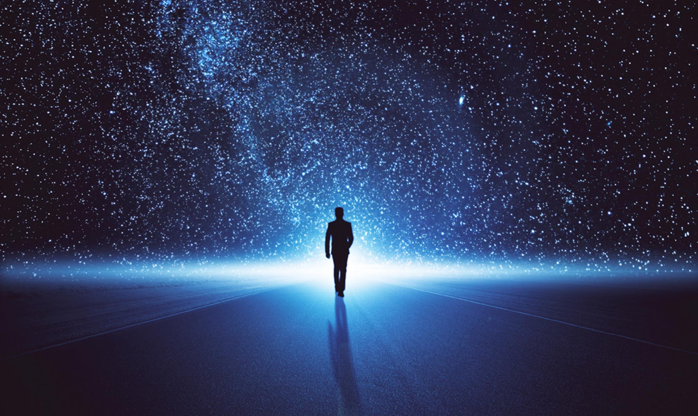
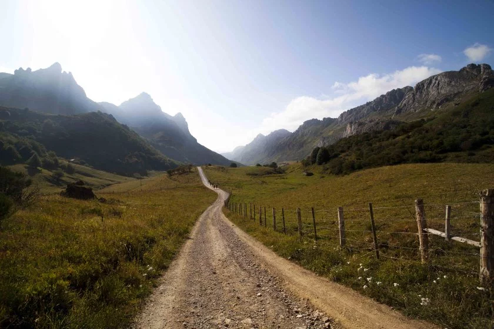

La exsitencia del hombre en todas sus expresiones. La vida. La muerte. La belleza en todas sus manifestaciones. La naturaleza. La cultura. La música. La historia. El tiempo... La lista es interminable y nos dan una idea -vaga- de la abismal complejidad de la realidad y constituyen, en su conjunto, un misterio que nos supera. 

_El sistema solar en el que se ubica nuestro planeta tierra, es tan sólo un "punto azul pálido" sumergido en la inmensidad del universo_

Los sorprendentes avances de la ciencia han dado pasos agigantados sobre el conocimiento de la realidad que nos rodea. Sin embargo, el aspecto científico es un aspecto más de la realidad diversa y sus aportes no nos ofrecen respuestas a todas las preguntas, sobre todo, a las preguntas ligadas a nuestra existencia: ¿De donde venimos? ¿Hacia dónde vamos? ¿Tenemos una misión en esta vida? ¿Por qué existe el mal y el sufrimiento? ¿Por existe injusticia?

A lo largo de la historia humana, personas de toda condición, se dejaron cautivar por misterio de la existencia: 

>_Interroga a la belleza de la tierra, interroga a la belleza del mar, interroga a la belleza del aire amplio y difuso. Interroga a la belleza del cielo, interroga al orden de las
estrellas, interroga al sol, que con su esplendor aclara el día; interroga a la luna, que con su claridad modera las tinieblas de la noche. Interroga a las fieras que se mueven
en el agua, que caminan sobre la tierra, que vuelan en el aire: almas que se esconden, cuerpos que se muestran; visible que se deja guiar, invisible que guía. ¡Interrógales!
Todos te responderán: ¡Míranos: somos bellos! Su belleza es como un himno de alabanza. Esta belleza mudable ¿quién la ha creado, sino la Belleza Inmutable?_

[San Agustín](https://es.wikipedia.org/wiki/Agust%C3%ADn_de_Hipona), Sermo CCXLI, 2: PL 38, 1134

>_En todo lo que suscita en nosotros el sentimiento puro y auténtico de la belleza está realmente la presencia de Dios. Existe casi una especie de encarnación de Dios en el mundo, cuyo signo es la belleza. Lo bello es la prueba experimental de que la encarnación es posible. Por esto todo arte de primer orden es, por su esencia, religioso_. 

[Simone Weil](https://es.wikipedia.org/wiki/Simone_Weil)

>_El ser humano es un buscador insaciable de la paz y de la felicidad. Ninguna adquisición de bienes materiales, ninguna situación vital, por satisfactoria que parezca, consigue detener esa búsqueda. Somos peregrinos hacia un destino de plenitud que no encontramos nunca del todo en el mundo._

[Benedicto XVI](https://es.wikipedia.org/wiki/Benedicto_XVI), Dios es Amor. 20