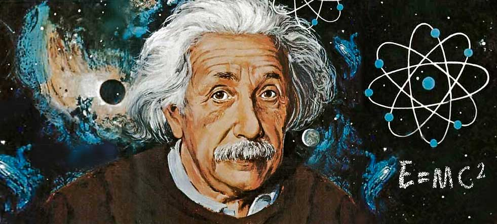

# Las pruebas sobre la existencia de Dios

La existencia de Dios no pertenece “necesariamente” a la fe. A esta verdad puede acceder el hombre mediante su razón. Esto no quita que también esta verdad esté revelada (la encontramos en la Sagrada Escritura).

El Concilio Vaticano I (1869-1870), definió la posibilidad universal de conocer a Dios, por medio de la sola razón natural. Sin embargo, no todos los hombres llegan a este conocimiento por su razón (a causa de la debilidad que ha dejado en nuestra inteligencia el pecado original) hay una “necesidad moral” de que esta verdad sea revelada por Dios, para que lleguen a la misma todos los hombres, prontamente y sin mezcla de error.

## Las cinco vías de Santo Tomás

Las pruebas más tradicionales para demostrar la existencia de Dios son estas cinco vías expuestas de modo magistral por Santo Tomás de Aquino (“Suma Teológica”, Prima pars, cuestión 2, artículo 3). Estas vías son cinco argumentos a posteriori (a partir de las cosas más conocidas por el hombre) que demuestran la existencia de Dios.

### Primera vía: Se funda en el movimiento

1. Es innegable, y consta a nuestros sentidos, que hay cosas que se mueven, es decir, que cambian. No se trata sólo del movimiento en sentido físico (locomoción), sino en sentido metafísico, es decir, como paso de la potencia al acto (cambios de una condición a otra, de un ser a otro, etcétera).

2. Pues bien, todo lo que se mueve, cambia, muda o transforma es movido por otro, ya que nada se mueve más que cuando está en potencia respecto a aquello para lo que se mueve. En cambio, mover requiere estar en acto, ya que mover no es otra cosa que hacer pasar algo de la potencia al acto, y esto no puede hacerlo más que lo que está en acto. Por ejemplo, el fuego hace que un leño -que está caliente sólo en potencia- pase a estar caliente en acto. Pero no es posible que una misma cosa esté, a la vez, en potencia y en acto respecto a lo mismo, sino en orden a cosas diversas. Es imposible que una misma cosa sea, por lo mismo y de la misma manera, motor y móvil, como también lo es que se mueva a sí misma. Por consiguiente, todo lo que se mueve es movido por otro.

3. Pero, si lo que mueve a otro es, a su vez, movido, es necesario que lo mueva un tercero, y a éste otro. Mas no se puede seguir indefinidamente, porque así no habría un primer motor, y, por consiguiente, no habría motor alguno, pues los motores intermedios no mueven más que en virtud del movimiento que reciben del primero, lo mismo que un bastón nada mueve si no lo impulsa la mano.

**Por consiguiente, es necesario llegar a un primer motor que no sea movido por nadie.**

4. Este primer motor que no es movido por nadie es el que todos entienden por Dios. Luego Dios existe.

### Segunda vía: Se basa en la causalidad eficiente

1. Nos consta por experiencia que hay en el mundo sensible un orden determinado entre las causas eficientes, pues están subordinadas esencialmente entre sí para la producción de un efecto común.

2. Pero no se da, ni es tampoco posible, que una cosa sea causa de sí misma, ni en el orden del ser ni en el de la operación pues en tal caso habría de ser anterior a sí misma, y esto es imposible.

3. Ahora bien: esa serie de causas eficientes, subordinadas esencialmente entre sí, no se puede prolongar indefinidamente, porque siempre que hay causas eficientes subordinadas, la primera es causa de la intermedia, y ésta causa de la última. Cada una de estas causas actúa por influjo de las causas que la preceden. Y así tenemos que, suprimida una causa se suprime su efecto. Por consiguiente, si no existiese una causa primera, tampoco existiría la intermedia, ni la última. Si, pues, se prolongase indefinidamente la serie de causas eficientes, no habría causa eficiente primera y, por tanto, no habría efecto último, ni causa eficiente intermedia, cosa falsa a todas luces.

**Por consiguiente, es necesario que exista una causa eficiente primera.**

4. Esta causa eficiente primera, que no es causada por ninguna otra, a la que están subordinadas todas las demás causas; es decir, esta causa eficiente incausada es llamada por todos Dios. Luego Dios existe.

### Tercera vía: Se fundamenta en la contingencia de los seres

1. Es evidente que hallamos en la naturaleza seres que pueden existir o no existir, pues vemos seres que vienen a la existencia por generación y seres que se destruyen por corrupción; es decir, seres que no tienen en sí mismos la razón de su existencia, sino que están condicionados por otros seres, y, por tanto, hay posibilidad de que existan y de que no existan. Estos seres reciben el nombre de seres contingentes.

2. Ahora bien: es imposible que los seres contingentes hayan existido siempre, ya que lo que tiene la posibilidad de no ser, hubo un tiempo en que no fue. Es decir, los seres contingentes, que tienen la posibilidad de existir y de no existir, reciben la existencia, no por sí mismos, sino por otro ser que ya existe. Así, pues, los seres contingentes son, por esencia efecto, seres que piden causa, seres que alguna vez han comenzado a existir causados por otro.

Pero, como ya se demostró antes (segunda vía), es imposible y absurdo que haya una serie infinita de seres contingentes, es decir, de causas subordinadas, ya que es imposible que sólo existan efectos.

**Por consiguiente, los seres contingentes exigen la existencia de un ser que no haya comenzado a existir; un ser no causado, que exista por sí mismo; un ser que ha existido siempre. A este ser se le llama ser necesario.**

3. Pero el ser necesario, o tiene la existencia por sí mismo, o la ha recibido de otro ser necesario superior. En esta segunda hipótesis, si el ser necesario ha recibido su existencia de otro ser necesario superior, es imposible aceptar una serie indefinida de seres necesarios. Es forzoso, por tanto, admitir la existencia de un ser necesario que exista por sí mismo y que no tenga fuera de sí la causa de su necesidad, sino que sea causa de los demás seres.

4. A este ser necesario, que no tiene la existencia recibida de otro, sino que existe por sí mismo, en virtud de su propia naturaleza, es al que todos llaman Dios. Luego Dios existe.

### Cuarta vía: Considera los grados de perfección que hay en los seres

1. Vemos en los seres que unos son más o menos buenos, más o menos verdaderos y nobles que otros; y lo mismo ocurre con las diversas cualidades. Así, por ejemplo, nadie duda que el hombre es más perfecto que el animal; el animal, más perfecto que el vegetal; y éste más perfecto que el mineral. Lo propio se ha de decir de la bondad, de la verdad, de la nobleza y de otras perfecciones semejantes, las cuales están realizadas en todos los seres según una diversidad de grados, en virtud de la cual unos seres son más perfectos que otros.

2. Pero la diversidad de grados que se da en esas perfecciones, es decir, las cosas más o menos buenas, más o menos verdaderas, más o menos bellas, etc., suponen la existencia de lo máximo; están reclamando un ser óptimo, verdaderísimo, bellísimo, etc. En otras palabras, esos grados dc perfección son algo causado por otro, el cual, si posee esas perfecciones en grado limitado, las tendrá, a su vez, causadas por otro.

3. Pero como es imposible admitir una serie infinita de causas limitadas, causadas, en este proceso de ascensión, llegamos a una primera causa en donde todas esas perfecciones se encuentran en grado sumo y en toda su plenitud. Por lo tanto, ha de existir algo que sea verísimo, nobilísimo, bellísimo y óptimo, y por ello ente o ser supremo, pues lo que es verdad máxima es máxima entidad.

**Ahora bien: quien tiene una perfección pura en grado máximo, o por esencia, es causa de esta perfección en todos aquellos que la poseen en grado inferior, o por participación. Además, no puede ser más que un único ser, una única perfección subsistente en sí misma, una única perfección en toda su plenitud y totalidad.**

4. Por consiguiente, existe algo que es para todas las cosas causa de su ser, de su bondad, de su belleza y de todas sus perfecciones, porque se trata del Ser sumo, de la Verdad suma, de la suma Bondad; y a este ser todos lo llamamos Dios. Luego Dios existe.

### Quinta vía: Se toma del gobierno del mundo

1. Vemos que cosas que carecen de conocimiento, como los cuerpos naturales, obran por un fin, como se comprueba observando que siempre, o casi siempre, obran de la misma manera para conseguir lo que más les conviene, es decir, su plena evolución y desarrollo, o la conservación de su especie, o el orden dinámico del cosmos, etc., por lo que se comprende que no van a su fin obrando al azar, sin rumbo ni orientación, sino intencionadamente.

2. Ahora bien: los seres que carecen de conocimiento no pueden tender a sus respectivos fines si no los dirige un ser inteligente que conozca dicho fin, a la manera como el arquero dirige la flecha.

3. Esta inteligencia ordenadora no puede estar ordenada por una serie indefinida de inteligencias, sino que es preciso llegar a un ser inteligente supremo, que consiste en su mismo acto de entender, un entender infinito, subsistente y único; es decir, que es el origen y el fundamento de todas las demás inteligencias que conocen y dirigen las cosas carentes de conocimiento a sus propios fines.

4. Luego existe un Ser inteligente supremo que dirige todas las cosas naturales a sus respectivos fines, y a este Ser lo llamamos Dios. Luego Dios existe.

## Desde la Biblia

Junto a estas cinco pruebas también podemos llegar a constatar la existencia de Dios aproximándonos a la realidad desde un fundamento bíblico:

### a) Conocimiento de Dios por medio de la creación

La Sagrada Escritura atestigua este principio: la razón humana puede conocer a Dios por medio de la creación, pues las cosas creadas son testimonio permanente de su Autor y llevan a su Conocimiento con alcance universal.

En este sentido, en el Libro de la Sabiduría encontramos dos motivos por los cuales el hombre puede alcanzar el conocimiento de Dios. Uno es la belleza que hay en las criaturas: por la contemplación de las diversas bellezas creadas, el hombre puede alcanzar el conocimiento de Aquel que es la fuente de toda belleza, Dios, Belleza Suprema. El otro motivo es el poder y la fuerza que existe en la naturaleza creada: las fuerzas de la naturaleza son un reflejo de la Omnipotencia de Aquel a quien se someten todas las potencias.

>_Vanos son por naturaleza todos los hombres que ignoran a y no alcanzan a conocer por los bienes visibles a Aquel-que-es, ni atendiendo a las obras, reconocieron al Artífice; sino que al fuego, al viento, al aire ligero, a la bóveda estrellada, al agua impetuosa o a las lumbreras del cielo los consideraron como dioses, rectores del universo. Si, seducidos por su belleza, los tuvieron como dioses, sepan cuánto les aventaja el Señor de todos ellos, pues es el Autor mismo de la belleza quien los creó. Y si se admiraron de su poder y de su fuerza, debieron deducir de aquí cuánto más poderoso es su Creador; pues, de la grandeza y de la belleza de las criaturas, se llega por razonamiento al claro conocimiento de su Autor. Con todo, no merecen éstos tan grave reprensión, pues tal vez caminan desorientados buscando a Dios y queriéndole hallar. Ocupados en sus obras, se esfuerzan en conocerlas, y se dejan seducir por lo que ven. ¡Tan bellas se presentan a sus ojos! Pero, por otra parte, tampoco son éstos excusables; porque, si llegaron a adquirir tanta ciencia y fueron capaces de investigar el universo, ¿Cómo no llegaron más fácilmente a descubrir a su Señor? (Sabiduría 13, 1-9)._

Muchos hombres de ciencia, con atitud de asombro ante la perfección de la creación, se han manifestado: 

>“Yo no he hecho más que buscar las leyes de Dios en el libro de la naturaleza"
[G. Marconi](https://es.wikipedia.org/wiki/Guillermo_Marconi)

>"El hombre encuentra a Dios detrás de cada puerta que la ciencia logra abrir" 
[A. Einstein](https://es.wikipedia.org/wiki/Albert_Einstein)

>"Me basta con examinar una brizna de hierba, o un puñado de tierra, para confirmar la existencia de Dios." 
[Isaac Newton](https://es.wikipedia.org/wiki/Isaac_Newton)

>“El conocimiento científico complementa la fe en Dios, en lugar de contradecirla” 
[Francis Collins](https://es.wikipedia.org/wiki/Francis_Collins)

>“La obra maestra más fina es la hecha por Dios, según los principios de la mecánica cuántica” 
[Erwin Schrödinger](https://es.wikipedia.org/wiki/Erwin_Schr%C3%B6dinger)

>“Dios está para el creyente en el principio de sus discursos, para el físico, en el término de los mismos” 
[Max Plank](https://es.wikipedia.org/wiki/Max_Planck)

>"La fuerza viva (energía) es un don con el que Dios ha dotado a la naturaleza y por tanto ésta no puede ser creada ni destruida" 
[J. P. Joule](https://es.wikipedia.org/wiki/James_Prescott_Joule)

>“No tengáis miedo de ser libres pensadores. Si piensas con suficiente fuerza, la ciencia te obligará a creer en Dios" 
[Lord Kelvin](https://es.wikipedia.org/wiki/William_Thomson)

### b) Conocimiento de Dios por los grados de perfección

Los grados de perfección que el hombre conoce en la naturaleza reflejan la perfección absoluta de un Dios único y personal, al que todos los hombres son llamados a adorar y a seguir.

>_La cólera de Dios se revela desde el cielo contra la impiedad e injusticia de los hombres, que aprisionan la verdad en la injusticia; pues lo que de Dios se puede conocer, está en ellos manifiesto: Dios se lo manifestó. Porque las perfecciones invisibles de Dios, su poder eterno y su divinidad, se han hecho visibles después de la creación del mundo por el conocimiento que de ellas nos dan las criaturas, de forma que son inexcusables; porque, habiendo conocido a Dios, no le glorificaron como a Dios ni le dieron gracias, antes bien se ofuscaron en vanos razonamientos, y su insensato corazón se llenó de tinieblas: jactándose de sabios se volvieron estúpidos, y cambiaron la gloria del Dios incorruptible por una representación en forma de hombre corruptible, de aves, de cuadrúpedos, de reptiles. Por eso, Dios los entregó a las apetencias de su corazón hasta una impureza tal que deshonraron entre sí sus cuerpos; a ellos que cambiaron la verdad de Dios por la mentira, y adoraron y sirvieron a la criatura en vez del Creador, que es bendito por los siglos. Amén. (Rom 1, 18-25; ver Hech 14, 14-18; 17, 22-30)._

En esta carta, el Apóstol San Pablo enseña claramente que el que no reconoce a Dios lo hace por opción libre, pues no se trata sólo de no percibir lo invisible de Dios en las cosas visibles, sino de un cerrazón del corazón que no quiere reconocer a Dios como Señor, y le niega el dominio sobre el hombre y sobre las cosas. Así, el hombre se degrada, no es capaz de reconocer su puesto en un mundo que se ha convertido en desordenado y caótico, y no acierta a descubrir la dimensión divina que aflora en todas las cosas.

### c) El testimonio de la conciencia

Asimismo, en la Sagrada Escritura encontramos otro medio a través del cual el hombre puede conocer a Dios: se trata de su conciencia, la cual expresa tanto la existencia de Dios como la ley natural que Dios escribió en el corazón de todo hombre.

>_Cuando los gentiles, que no tienen Ley, cumplen las prescripciones de la Ley guiados por la razón natural, sin tener Ley son para sí mismos Ley -es decir, obran según su conciencia-. Y con esto muestran que los preceptos de la Ley están escritos en sus corazones, siendo testigo su conciencia con los juicios que, alternativamente, ya les acusan o bien les defienden. (Rom 2. 14-15)._

Los que no han recibido la Revelación de Dios conocen por su razón natural los principios esenciales que informan la ley natural. En la intimidad de su corazón, todo hombre tiene grabada una ley moral natural que participa de la ley eterna de Dios.

Por último, podemos también llegar a demostrar la existencia de Dios desde la propia experiencia interior.

## Experiencia personal de Dios

Hay muchas personas que no necesitan de esos argumentos antes señalados para creer y amar a Dios, la experiencia interior de percibirse volcado hacia algo eterno lo conduce hacia Aquel Único Eterno, Dios mismo que toca el corazón para entrar en una infinita comunión de amor, en un diálogo personal e intenso.

Es más, el mismo hecho de estar en mayor sintonía con el sello que con su Imagen Dios ha marcado al hombre, lleva a la persona a acercarse a Dios de manera natural, teniendo la convicción de la existencia de Dios como la luz del día o las estrellas de la noche.. Justamente, como imagen de Dios, el hombre conserva esa convicción divina no como algo extraño y añadido por la presión de la cultura, sino como algo propio, como el fundamento radical de su ser, como la luz que explica el dinamismo de su vida, y como el amor en el que encuentra su plenitud.

Ejemplos en la historia de la Iglesia hay muchos, que al momento de ver el propio interior se encuentran con Aquel que ilumina cada espacio del propio ser.

Vemos esto en el testimonio de San Agustín: 

>_"Y he aquí que oigo de la casa vecina una voz, no sé si de un niño o de una niña, que decía cantando, y repetía muchas veces: ¡Toma, lee; toma, lee! Y al punto, inmutado el semblante, me puse con toda atención a pensar, si acaso habría alguna manera de juego, en que los niños usasen canturrear algo parecido; y no recordaba haberlo jamás oído en parte alguna. Y reprimido el ímpetu de las lágrimas, me levanté, interpretando que no otra cosa se me mandaba de parte de Dios, sino que abriese el libro y leyese el primer capítulo que encontrase. Porque había oído decir de Antonio, que por la lección evangélica, a la cual llegó casualmente, había sido amonestado, como si se dijese para él lo que se leía: "Ve, vende todo cuanto tienes, dalo a los pobres, y tendrás un tesoro en los cielos; y ven y sígueme" (Mt 19, 31); y con este oráculo, luego se convirtió a Vos. Así que volví a toda prisa al lugar donde estaba sentado Alipio, pues allí había puesto el códice del Apóstol al levantarme de allí; lo arrebaté, lo abrí y leí en silencio el primer capítulo que se me vino a los ojos: 'No en comilonas ni embriagueces; no en fornicaciones y deshonestidades; no en rivalidad y envidia; sino vestíos de nuestro Señor Jesucristo, y no hagáis caso de la carne para satisfacer sus concupiscencias' (Rom 13, 13-14). No quise leer más, ni fue menester; pues apenas leída esta sentencia, como si una luz de seguridad se hubiera difundido en mi corazón. todas las tinieblas de la duda se desvanecieron"._

También, como testimonios más cercano a nuestra época, tenemos al Cardenal Newman, que en su afán de profundizar en la vida interior, se convierte al catolicismo por la oración y el estudio. Asimismo, está Claudel que se siente conmovido en su espíritu al oír el canto del Magníficat en una tarde de Navidad; y confiesa:

>_"Qué dichosas son las personas que creen! Pero... si fuera verdad... ¡Es verdad! ¡Dios existe, está ahí! ¡Es alguien, es un ser tan personal como yo! Me ama. Me llama"._ 
 
 
La causa eficiente convierte en  actual lo que antes era potencial. Hace pasar algo de potencia a algo. Ejemplo: la madera de un árbol potencialmente es una mesa. El carpintero toma la madera y hace la mesa. El carpintero será la causa eficiente. Otro ejemplo: un relojero (causa eficiente) puede tomar las ruedecillas y piezas de un reloj y, después de ordenarlas, monta el reloj.

_Fuente de conocimiento:_ 

 * https://www.aciprensa.com/apologetica/existencia.htm
 * http://www.aplicaciones.info/filosofia/metai11.htm_
 * http://es.catholic.net/op/articulos/14619/cinco-vias-de-santo-tomas.html

